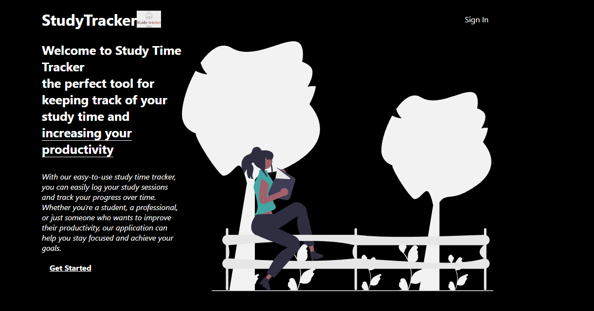
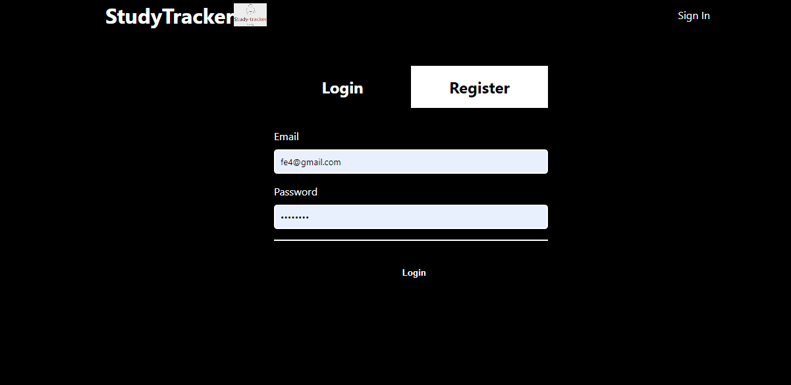
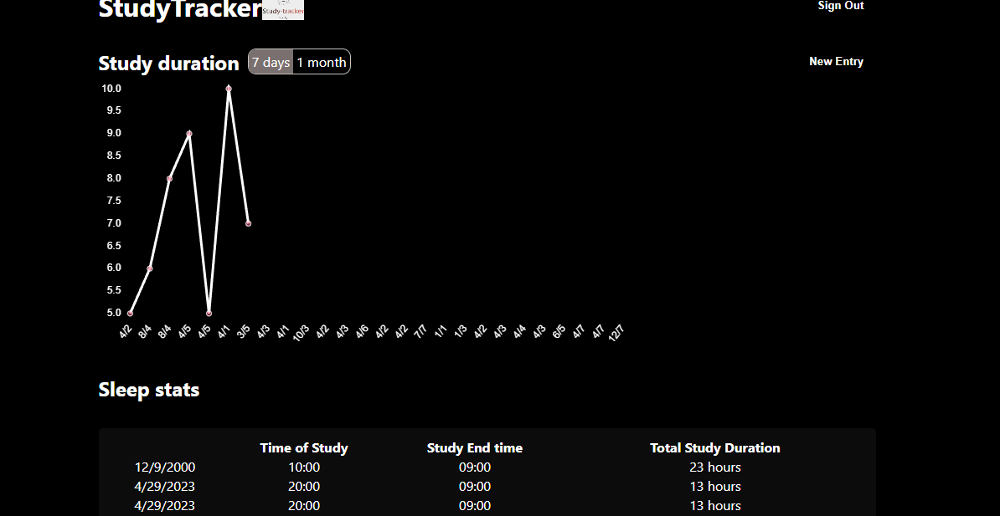

# Study Tracker Web App

A user-friendly Web App designed to help you track your daily study time. you can easily log in the amount of time you spend studying each day and keep track of your progress over time.

# Screenshot





# Features

- Signup/login page
- Display of Study details in a chart
- Display of study detail in a table

## Tech Stack

**Client:** React, Redux/toolkit

**Server:** Node, Express

## Installation

Install my-project with npm
JWT_SECRET- JWT Secret Key

MONGO_URI- Mongo DB URI

```bash
  npm install
  npm run dev
```
